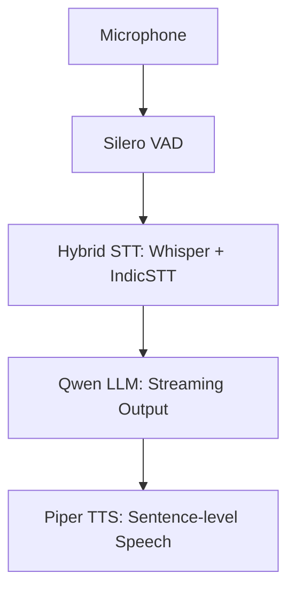

## Architecture Overview

The system follows a sequential pipeline to process voice and generate speech:



##Clone the files from git, install and activate venv
```
git clone https://github.com/Samarth-4604/VAD-STT-LLM-TTS.git
cd VAD-STT-LLM-TTS/
sudo apt install python3-venv
python3 -m venv venv
source venv/bin/activate
```
# Install dependencies
```
pip install -r requirements.txt
```
## Model Setup (Required)

This repository does not include model weights.

### Qwen LLM download and placement
Download from Hugging Face from:
```
https://huggingface.co/Qwen/Qwen2.5-3B
```
```
sudo apt update && sudo apt install git-lfs -y
git lfs install
cd ~/VAD-STT-LLM-TTS/Qwen2.5-3B
git lfs pull
mkdir -p ~/VAD-STT-LLM-TTS/models/llm/qwen
cd ~/VAD-STT-LLM-TTS
rm -rf Qwen2.5-3B
echo "Download and move complete! Checking file sizes..."
ls -lh ~/VAD-STT-LLM-TTS/models/llm/qwen/
```

note: qwen 3b is weak in malayalam it is used here due to low vram, i reccomend using 4b or 8b models.

After this, your folder should contain files like:
config.json
model.safetensors
tokenizer.json
tokenizer.model


### Whisper STT
Models are downloaded automatically on first run.
Optional cache directory:
models/stt/whisper/

### Piper TTS
Download voice models from:
```
https://huggingface.co/rhasspy/piper-voices
```

Place voices under:
models/tts/piper/


## Configuration
The primary configuration file is located at: whisper_stt/config/config.yaml

This file controls:

Audio Parameters: Sample rate, channels, etc.

Model Selection: Choose specific Whisper or IndicSTT versions.

Language Routing: Logic for handling English vs. Malayalam.

[!IMPORTANT]

Not all configuration fields are active in the current CPU-only mode. Some options are reserved for future GPU-enabled operation.


## CPU vs GPU Execution

TeacherBot runs in **CPU-only mode by default** to ensure stability on
low-VRAM systems.

GPU (CUDA) execution is intentionally **disabled in code**, not just by
configuration. The CPU lock is enforced in the following components:

- `whisper_stt/src/hybrid_stt.py`
- `whisper_stt/src/whisper_stt.py`
- `run_qwen_teacher.py`

To enable GPU execution, the following changes are required:

1. Replace the hard-coded device assignment (`device="cpu"`) with a
   configurable device (e.g. `"cuda"`).
2. Ensure sufficient GPU memory is available for the selected models.
3. Test stability under streaming workloads.

This design prevents accidental CUDA out-of-memory errors and makes
GPU usage an explicit, deliberate choice.


## Installation & Usage

# Create a virtual environment
```
python -m venv venv
```
# Activate environment (Linux/macOS)
```
source venv/bin/activate
```
# Install dependencies
```
pip install -r requirements.txt
```


##Running the Assistant
```
python run_teacherbot_voice.py
```
Interact: Speak naturally into the microphone.

Exit: Press Ctrl+C.
